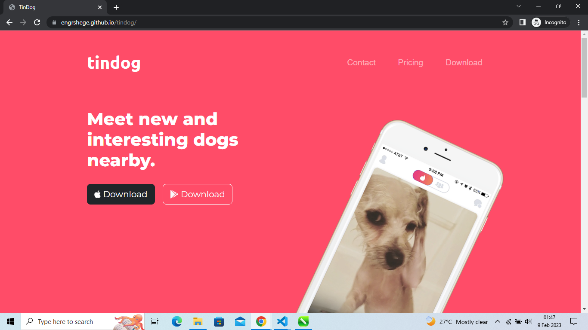

# TinDog 🐶
TinDog is a landing page standing in as a practice assessment from @angelabauer Web Development course. I placed it on Github so I could follow up closely on completing the assessment as a means to improve my skill.

## Deployment

Live Demo: https://engrshege.github.io/tindog/

Picture Preview:

Video Preview:
https://user-images.githubusercontent.com/52855925/219947299-4b3af208-5528-4b80-adb6-7e9a63b5bdc7.mp4
[]
]

## Built With

  * HTML
  * CSS
  * Bootstrap

## Authors

  - **Oluwasegun Idowu**
    [engrshege](https://github.com/engrshege/)
    
    
## Assesment Completed

  * Tuesday, 14 Feb. 2023

## License

This project is licensed under the MIT License.

Copyright (c) 2023 Oluwasegun Idowu

Permission is hereby granted, free of charge, to any person obtaining a copy
of this software and associated documentation files (the "Software"), to deal
in the Software without restriction, including without limitation the rights
to use, copy, modify, merge, publish, distribute, sublicense, and/or sell
copies of the Software, and to permit persons to whom the Software is
furnished to do so, subject to the following conditions:

The above copyright notice and this permission notice shall be included in all
copies or substantial portions of the Software.

THE SOFTWARE IS PROVIDED "AS IS", WITHOUT WARRANTY OF ANY KIND, EXPRESS OR
IMPLIED, INCLUDING BUT NOT LIMITED TO THE WARRANTIES OF MERCHANTABILITY,
FITNESS FOR A PARTICULAR PURPOSE AND NONINFRINGEMENT. IN NO EVENT SHALL THE
AUTHORS OR COPYRIGHT HOLDERS BE LIABLE FOR ANY CLAIM, DAMAGES OR OTHER
LIABILITY, WHETHER IN AN ACTION OF CONTRACT, TORT OR OTHERWISE, ARISING FROM,
OUT OF OR IN CONNECTION WITH THE SOFTWARE OR THE USE OR OTHER DEALINGS IN THE
SOFTWARE.

## Acknowledgments

  * The Complete 2021 Web Development Bootcamp by Dr. Angela Yu.
